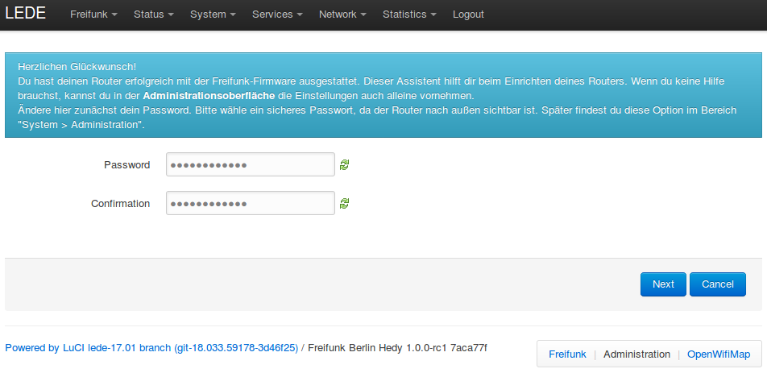
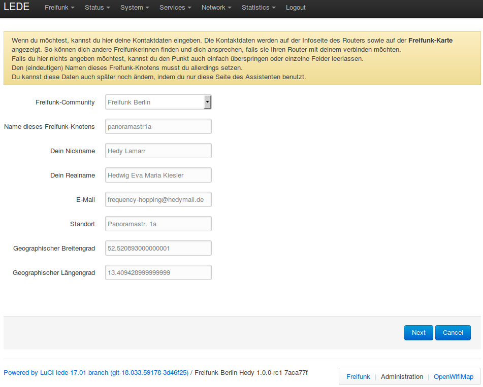
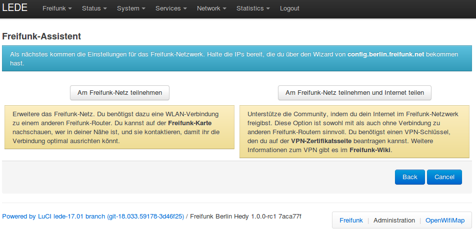
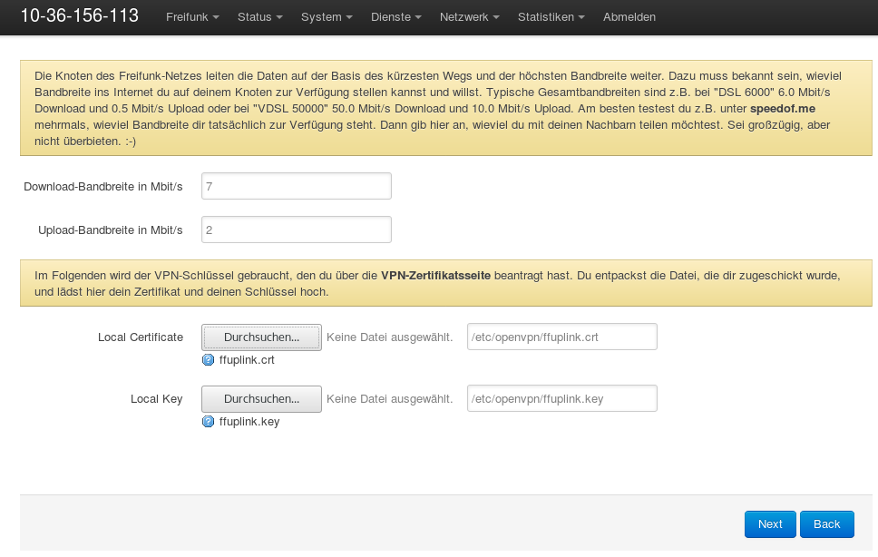
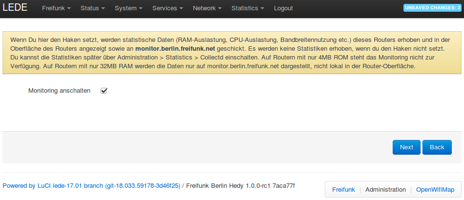
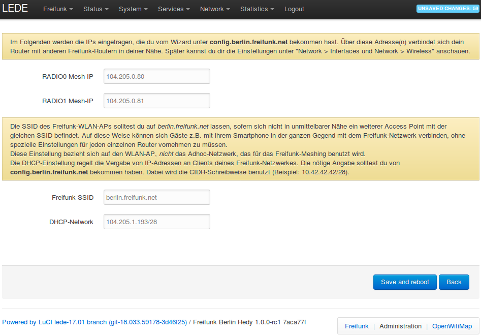
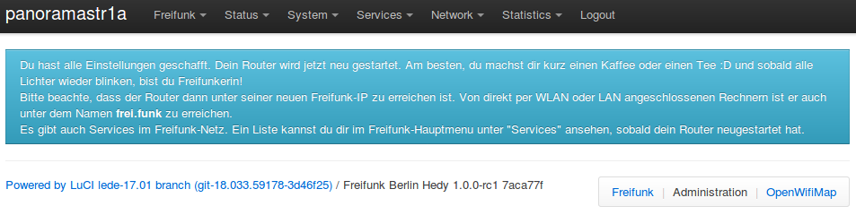

Router einrichten
=================

Du hast dir bereits IP-Adressen geholt und deinen Router erfolgreich geflashed. Jetzt kannst du den Router mittels des Berliner Freifunk-Assistenten einrichten.

Passwort setzen
---------------

Gehe auf die Website des Routers http://frei.funk oder http://192.168.42.1/ und setze zuerst ein neues Passwort.

Klicke auf *Next*.

Kontaktdaten
------------

Jetzt erscheint die Kontaktseite, auf der du deine Kontaktdaten eingeben kannst. Wenn du Dich dafür entscheidest, hier deine Daten korrekt einzugeben, ist es anderen FreifunkerInnen möglich, sich mit Dir in Verbindung zu setzen, falls sie ihren Router mit deinem verbinden möchten.

Klicke auf *Next*.

Teilnehmen und Internet teilen
------------------------------

Auf dieser Seite musst du dich entscheiden, wie du am Freifunk-Netz teilnehmen möchtest:

* Am Freifunk-Netz teilnehmen
   Falls du nur das Freifunk-Netz erweitern möchtest, ohne dein Internet zu teilen, muss ein anderer Freifunk-Router in der Nähe sein, mit dem sich dein Router verbinden kann (das nennt sich "meshen"). In unserer `Karte <https://hopglass.berlin.freifunk.net/>`_ findest du viele der Berliner Freifunk-Router. Du kannst auch andere FreifunkerInnen kontaktieren, um eine optimale Ausrichtung der Router abzusprechen.

* Am Freifunk-Netz teilnehmen und Internet teilen
   Falls du – zusätzlich zur Teilnahme am Freifunk-Netz – dein Internet teilen möchtest, klicke auf den Button *Am Freifunk-Netz teilnahmen und Internet teilen*.

Klicke auf eine der beiden Optionen.

.. note::
   Falls du dein Internet nicht teilst, den nächsten Punkt bitte überspringen.

Uplink einrichten und Bandbreite Freigeben
------------------------------------------

Die folgende Seite zur Konfiguration, wie du dein Intnernet teilen willst, ist abhängig vom gewählten Uplink-Typ (siehe :ref:`sec-image-typen`).

Im oberen Bereich kannst du eingeben, wie viel Bandbreite du dem Freifunk-Netz zur Verfügung stellen möchtest.

.. note::
   Ein guter Richtwert ist, 20% bis 35% des eigenen Internetanschlusses freizugeben. Falls du mehr spenden möchtest, ist darum auch niemand böse. ;-)

Klicke auf *Next*.

Monitor anschalten
------------------

Hier kannst das zentrale Monitoring einschalten. Dadurch werden Statistikdaten an http://monitor.berlin.freifunk.net/ gesendet. Diese Daten können helfen, Probleme im Freifunknetz zu analysieren.

Klicke auf *Next*.

WLAN-Einstellungen
------------------

Hier konfigurierst du die IP-Adressen für deinen Router, die du vom Wizard zur IP-Vergabe bekommen hattest.

* RADIO Mesh-IP
   Je nachdem auf wievielen Frequenzen dein Router sendet, kannst du entweder eine oder zwei IP-Adressen zum Meshen konfigurieren. Über diese Adressen kann sich dein Router mit anderen Freifunk-Routern verbinden und erweitert so das Netz.

* Freifunk-SSID
   Die SSID ist der Name deines Freifunk-Netzes mit dem du, deine Besucher und deine Nachbarn sich später per Handy oder Computer verbinden können.

* DHCP-Network
   Mit dem Addressraum werden die IP-Adressen konfiguriert, die Nutzer deines Zugangspunktes erhalten.

Wenn du jetzt noch ein letztes Mal auf *Save and Reboot* Klickest, hast du es geschafft!

Kaffee oder Tee trinken
-----------------------

Wenn du zuvor auf "Internet teilen" geklickt hast, musst du jetzt den Freifunk-Router nur noch über die blaue Buchse ("WAN" / "Internet") mit deinem Router verbinden. Nun funkst du frei! :D

Router-Einstellungen aufrufen
-----------------------------

Dein Router ist nach der Erstkonfiguration via http://frei.funk/ erreichbar. Das aufrufende Gerät muss direkt per (W)LAN angeschlossenen sein.

Bei Fragen oder Problemen empfiehlt sich ein Blick in die `Häufigen Fragen <https://wiki.freifunk.net/Berlin:Firmware#H.C3.A4ufige_Fragen>`_ im Freifunk-Wiki.
