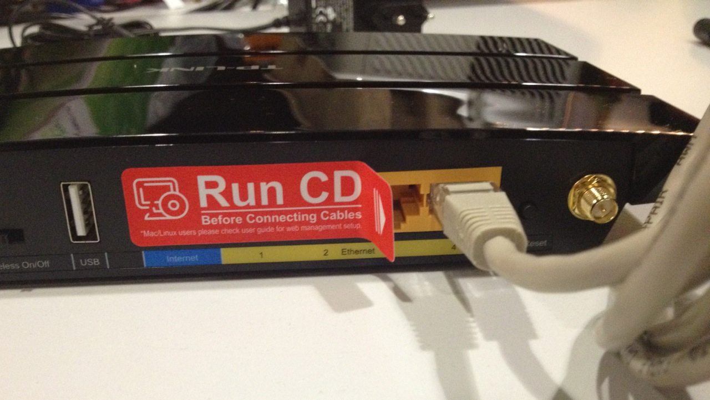
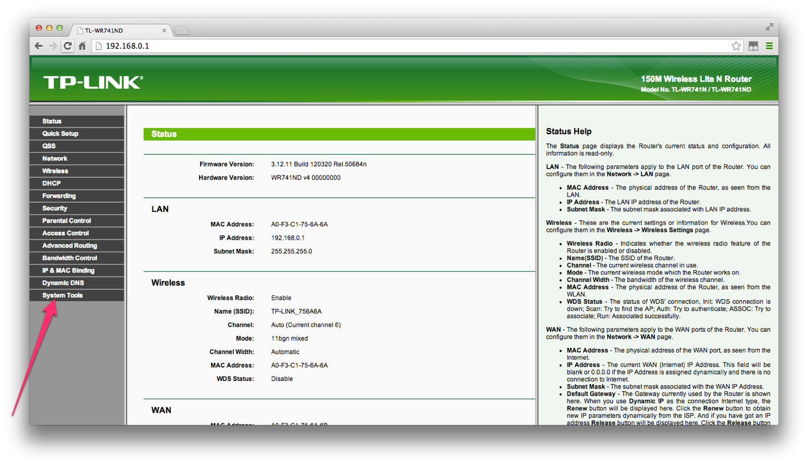
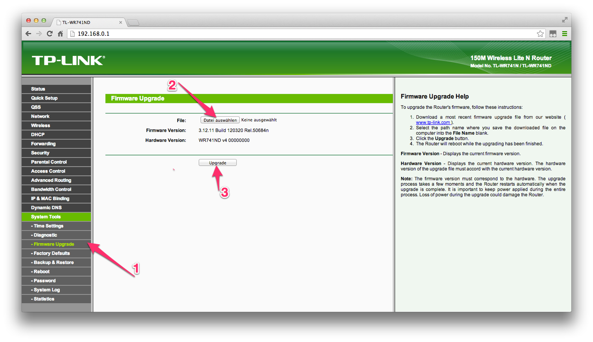
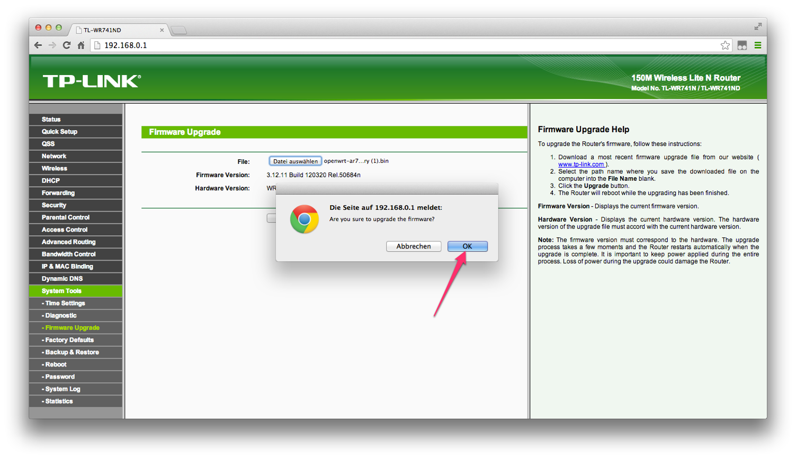
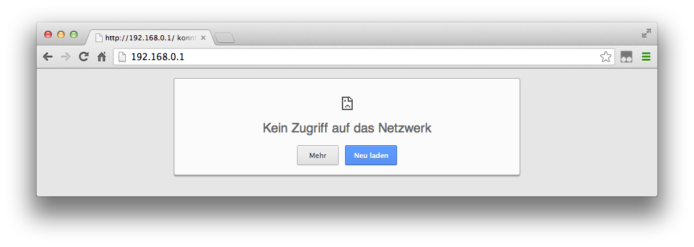

Firmware installieren
=====================

Dieses Howto bezieht sich in erster Linie auf die Indoor-Router von TP-Link. Bei anderen Routern kann die Prozedur zum Flashen abweichen. Die Konfiguration der Berliner Freifunk-Firmware läuft aber auch dort genauso ab.

Freifunk-Router mit dem Computer verbinden
------------------------------------------

Bitte schließe deinen Router an eine Steckdose an - das Kabel dazu ist dabei. Die Antenne kannst du jetzt oder auch später aufschrauben. Verbinde dann den Router mit dem beiliegenden grauen LAN-Kabel mit deinem Computer. Stecke dafür das Kabel in eine der gelben Buchsen (die blaue Buchse brauchst du später).

Firmware einspielen
-------------------

Jetzt kannst du den Router einfach über den Browser konfigurieren. Dazu rufst du in deinen Browser folgende Adresse auf: http://192.168.0.1/.
Bevor du weitermachst, musst du dich erst anmelden. Die wenig kreative Username/Passwort-Kombination ist: admin / admin
Dein Browserfenster müsste nun so aussehen – Folge hier dem Link "System Tools".

Als nächstes wählst du aus dem Menü "Firmware Upgrade" (1). Danach kannst du die vorhin (bei :ref:`sec-prep-download`) geladene Datei zum Hochladen auswählen (2). Nach einem Klick auf "Upgrade" (3) beginnt der Prozess.

.. note::
   Zum **TL-WR841N v8.4**: Beim Flashen über das Firmware-Upgrade der Original-Firmware tritt ggf. folgender Fehler auf:
   Error code: 23002

   The uploaded file name is too long!

   Hier hilft einfaches Umbenennen der heruntergeladenen Freifunk-Firmware vor dem Upload.

Du musst noch einmal kurz bestätigen…

…und die Installation läuft. Während die Installation läuft, zieh bitte auf keinen Fall den Stecker oder das Netzwerk-Kabel – denn dann wäre dein Router hinüber.

Abschluss
---------

Nachdem die Firmware fertig eingespielt ist, startet der Router neu.

Dass der Router neu startet merkst du auch am Blinken der Lämpchen an deinem Router. Zuerst blinken alle Lämpchen wild, dann gehen sie aus. Wenn danach das Lämpchen mit dem Zahnrad gemütlich vor sich hin blinkt, ist der Router bereit zum Konfigurieren (nächster Abschnitt).

Jetzt ist der Router nicht mehr unter der angegebenen Adresse erreichbar, und eine Fehlermeldung erscheint. Das ist gut so, denn nun läuft nicht mehr die alte Firmware, sondern die neue Freifunk-Firmware auf deinem Router. Deinen Router erreicht du, indem du die folgende Adresse in deinem Browser eingibst: http://frei.funk/ oder http://192.168.42.1/.

Als nächstes musst du deinen Router noch einrichten und im Freifunk-Netz anmelden.

.. note::
   Solltest Du Fragen oder Probleme haben oder Einträge deines Knoten ändern wollen, erreichst du uns unter:

   berlin@berlin.freifunk.net

*Diese Anleitung basiert auf https://github.com/rainersax/FreifunkHamburgHandbuch*.