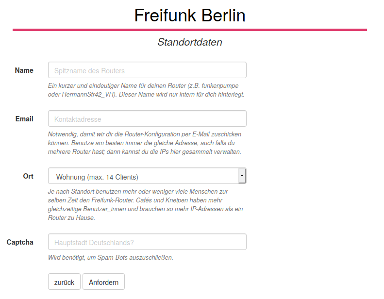

Vorbereitungen
==============

In diesem Abschnitt werden alle Vorbereitungen durchgegangen, bevor wir im nächsten Abschnitt mit der Installation und der eigentlichen Einrichtung von Freifunk beginnen können.

Router auswählen und kaufen
---------------------------

Grundsätzlich könnten wir alle Router unterstüzen, die auch durch OpenWRT unterstützt werden. Da Freifunk für uns aber auch nur ein Hobby ist, haben wir uns auf einige Router beschränkt. Eine Auflistung dieser Geräte findest du im `Freifunk-Wiki <https://wiki.freifunk.net/Berlin:Firmware#Unterst.C3.BCtzte_WLAN-Router>`_. Bitte beachte unbedingt die Fußnoten, da nicht alle Geräte gleich gut unterstüzt werden.

Einige gute Router kann man auch günstig auf Flohmärkten oder auf Anzeige-Platformen, wie z.B. ebay-kleinanzeigen bekommen.

.. note::
   Falls du die Firmware für einen neuen Router portieren kannst und möchtest, würden wir uns sehr freuen. Nähere Infos findest du im :ref:`sec-development`.

IP-Adresse reservieren
----------------------

Für die Konfiguration des Routers wird eine IP-Adresse benötigt. Diese kannst du unter config.berlin.freifunk.net reservieren. Dort drückst du *IP-Vergabe (Standard/Wizard)*, anschließend *weiter =>* und gibts die gefragten Informationen ein. 

Diese Adressen werden vom Router zum Meshen und für die Clients benutzt.

.. _sec-prep-download:

Firmware-Image herunterladen
----------------------------

Die passende Firmware für deinen Router kannst du auf der `Firmware-Wiki-Seite <https://wiki.freifunk.net/Berlin:Firmware#Unterst.C3.BCtzte_WLAN-Router>`_ von Freifunk-Berlin, Link in der Tabelle ganz links, herunterladen. Bitte beachte, dass nicht alle dort angegebenen Router release-Status besitzen. In den Fußnoten kannst du weitere Hinweise und Tipps zu den jeweiligen Routern finden.

.. _sec-image-typen:

Image-Typen
^^^^^^^^^^^

Unsere Firmware gibt es in verschiedenen Varianten. Generell unterscheiden wir zwischen factory-Images und sysupgrade-Images. **Factory-Images** (Erstinstallation) werden ausschließlich beim ersten Flashen des Routers benutzt, also dann, wenn von der originalen Firmware auf die Freifunk-Firmware geflasht wird. Wenn auf deinem Router bereits einmal eine Freifunk-Firmware oder OpenWRT installiert waren, werden die **Sysupgrade-Images** benutzt.

Es gibt noch Untertypen, welche hier aufgelistet sind. Hauptunterschied ist, ob ein VPN verwendet wird oder nicht.

+ default & default_4MB (no-tunnel)
    Die default-Firmware leitet den Datenverkehr nicht durch einen Tunnel. Stattdessen wird er direkt ins Internet ausgeleitet. 
    Im 4MB Image sind B.A.T.M.A.N. und collectd (für `online-Statistiken <https://monitor.berlin.freifunk.net>`_) nicht enthalten, um Platz zu sparen.

+ tunnel-berlin-tunneldigger
    tunneldigger-Firmwares leiten den Datenverkehr durch einen Tunnel. So wird die IP-Adresse deines Internetanschlusses verschleiert. Dabei nutzen wir `tunneldigger <https://github.com/wlanslovenija/tunneldigger>`_, dass von WLAN-Slowenija entwickelt wird. Es ist sehr ressourcensparend.

+ backbone & backbone_4MB
    Das Image für alle, die manuell konfigurieren wollen. Der Einrichtungsassistent und OpenVPN fehlen, dafür sind mehr Debugging-Netzwerktools verfügbar. Im 4MB Image ist collectd (die Statistiken in https://monitor.berlin.freifunk.net) nicht enthalten.

.. note::
    Seit der Novelle des Telemediengesetzes im Sommer 2017 kann ein Betreiber von offenem WLAN formal weder kostenpflichtig abgemahnt noch schadenersatzpflichtig gemacht werden (`§8 (3) TMG <http://www.gesetze-im-internet.de/tmg/__8.html>`_).

    Diese Auffassung hat sich jedoch bei der Rechtsprechung noch nicht komplett durchgesetzt (siehe `hier <http://freifunkstattangst.de/2020/06/12/die-alte-dame/>`_). Wir empfehlen daher für sorgloses Freifunken eher die Benutzung einer Firmware mit VPN.

    Wenn Du trotzdem gerne deinen Internetanschluss ohne Tunnel teilst, findest Du hier einen praktischen `Abmahnbeantworter <https://abmahnbeantworter.ccc.de/>`_, mit dem Du Kanzlei-Briefe beantworten kannst. Bei rechtlichen Fragen kannst du dich auch jederzeit an den `Förderverein <https://foerderverein.freie-netzwerke.de/>`_ wenden. Erfahre mehr über deine Rechte unter `freifunkstattangst.de <https://freifunkstattangst.de>`_.
