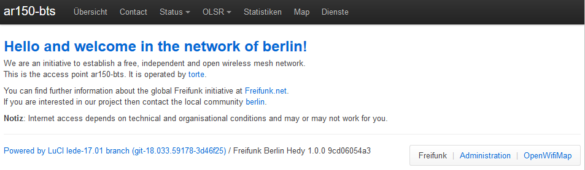
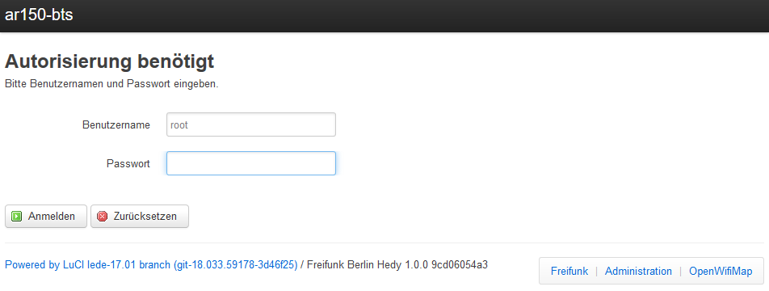
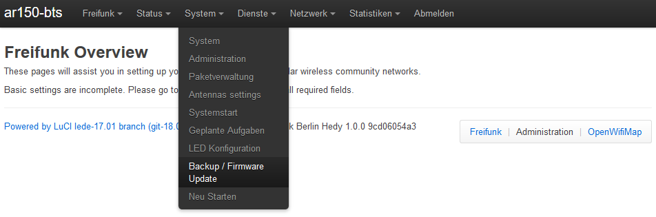
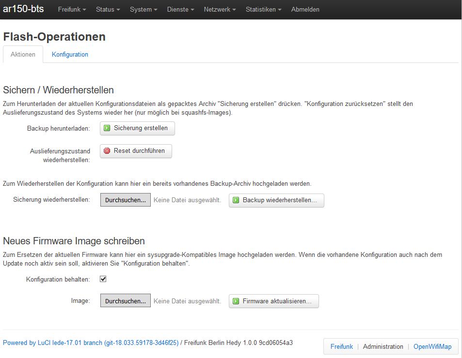

Backup und Wiederherstellung
============================

.. _sec-backup-restore:

Allgemeines zu Backup und Wiederherstellung
-------------------------------------------

Um ein Backup deiner Konfigurationsdateien zu speichern, musst du dich zuerst auf deinem Router einloggen. Verbinde dich dazu entweder mit einem LAN-Kabel oder über W-LAN. Öffne die Webseite des Routers unter http://frei.funk und klicke auf den Knopf *Administration* unten rechts auf der Seite.

Anmeldung als Administrator
^^^^^^^^^^^^^^^^^^^^^^^^^^^

Melde dich mit deinem Passwort an. Falls du dein Passwort vergessen hast, folge bitte `diesen <https://openwrt.org/docs/guide-user/troubleshooting/failsafe_and_factory_reset#useful_commands_and_procedures>`_ Schritten.

Backup / Firmware Update
^^^^^^^^^^^^^^^^^^^^^^^^

Wähle die Option *Backup / Firmware Update* im *System* Menü.

Archiv erstellen
----------------

Klicke auf den Button *Sicherung erstellen* und speichere das Archiv an einem sicheren Ort.

Archivinhalt
^^^^^^^^^^^^

Das Archiv ist im tar.gz Format gespeichert. Darin befinden sich die Daten deiner Routerkonfiguration.

Die folgenden Dateien enthalten die Informationen, die man im Assistenten neu eingibt:

+ /etc/config/freifunk
   Die Kontaktadresse befindet sich im ersten Abschnitt.

+ /etc/config/ffwizard
   Die IP-Adressen und andere bei der Ersteinrichtung eingegebenen Informationen sind hier gespeichert.

+ /etc/config/system
   Hier befinden sich der Name des Routers und die GPS-Koordinaten.

Das Archiv enthält noch weitere Datein. Ihre Dokumentation findest du im Wiki von OpenWrt.

Sicherung wiederherstellen
--------------------------
.. warning::
   Benutze die Wiederherstellungsoption nur mit dem gleichen :ref:`sec-image-typen`, mit dem auch das Backup erstellt wurde!

Nach den Schritten in :ref:`sec-backup-restore`, klicke auf den *Durchsuchen* Button im Unterabschnitt *Wiederherstellung*, um Deine Backup-Archiv Datei auszuwählen. Klicke danach auf den Button *Backup wiederherstellen...*.

Auslieferungszustand wiederherstellen
-------------------------------------

Um den Router in den Zustand wie frisch nach dem Flashen zurückzusetzen und mit dem Assistenten neu zu starten, klicke auf den Button *Reset durchführen*. 
