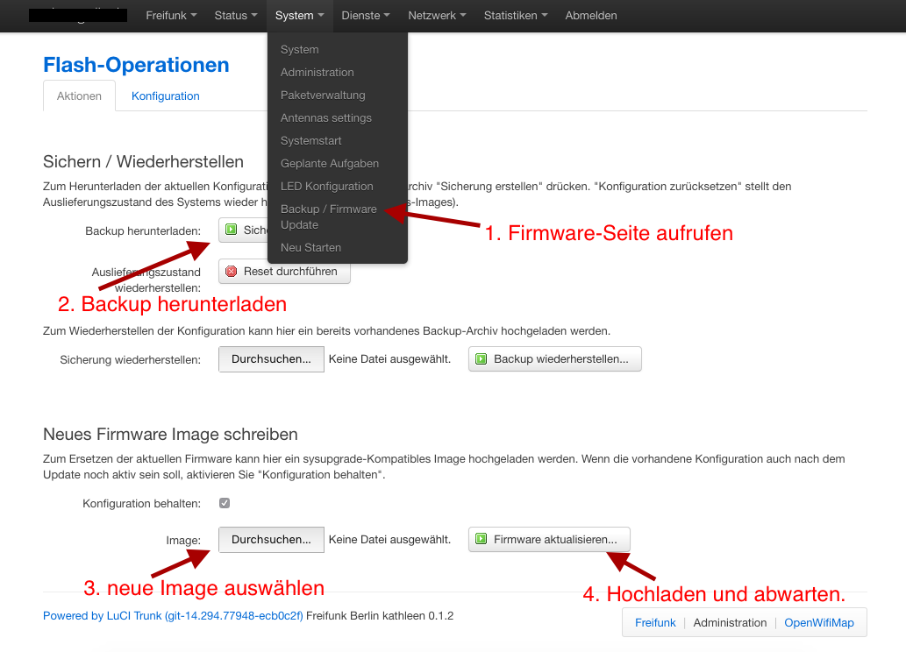

Firmwareupgrade einspielen
==========================

Logge Dich auf Deinem Router ein (http://frei.funk) und klicke auf *Administration*. Klicke anschließend auf den Menüpunkt *System* und klicke auf *Backup / Firmware Update*.

Am besten erstellst du durch einen Klick auf *Sicherung herunterladen* ein Backup Deiner Konfiguration. So kannst Du, falls etwas schief geht, jederzeit mit wenigen Klicks alles in den ursprünglichen Zustand versetzen.

Wähle nun mit *Durchsuchen* das Image aus und lade es mit *Firmware aktualisieren* auf den Router.

Auf der nächsten Seite werden dir einige Informationen zum Image angezeigt. Ist alles in Ordnung, bestätige das Flashen mit *OK*.

